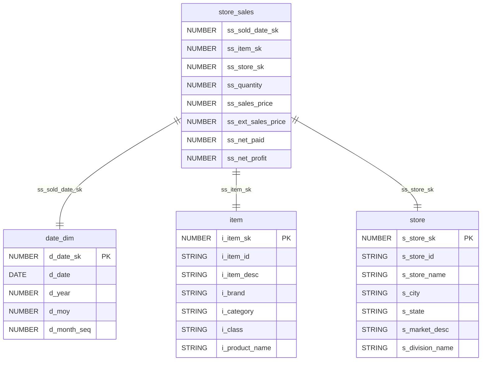
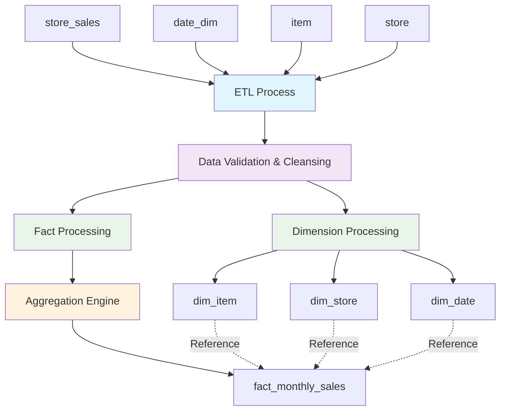
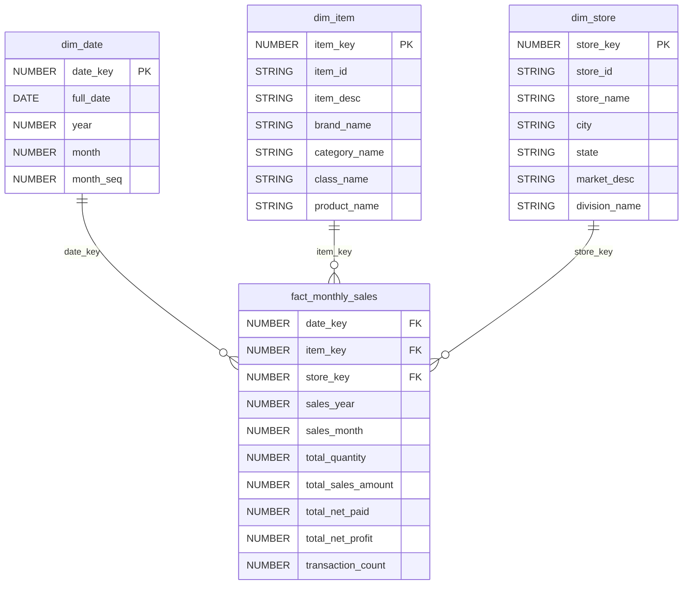

# ETL Design Document - Monthly Sales Star Schema

## Overview

### Objective
Design and implement an ETL pipeline to transform transactional sales data into a star schema data warehouse optimized for monthly sales performance analysis. The solution will enable business analysts to track sales performance by item and store over time.

### Scope
- Extract data from four source tables: store_sales, date_dim, item, and store
- Transform data to create a star schema with one fact table and three dimension tables
- Load data into target tables optimized for analytical queries
- Aggregate sales data at monthly level for performance analysis

### Out of Scope
- Real-time data processing
- Daily or weekly aggregations
- Customer dimension analysis
- Historical data migration beyond current ETL scope
- Data archival and retention policies

### Assumptions
- Source data is available in a relational database
- Data quality issues are minimal and can be handled with standard validation
- Monthly aggregation is sufficient for business requirements
- Surrogate keys in source tables are reliable and consistent
- Target database supports SQL DDL operations

## Source to Target Mapping

### Fact Table: fact_monthly_sales

| Source Column | Source Table | Target Column | Transformation Logic |
|---------------|--------------|---------------|---------------------|
| d_date_sk | date_dim | date_key | Direct mapping of date surrogate key |
| ss_item_sk | store_sales | item_key | Direct mapping of item surrogate key |
| ss_store_sk | store_sales | store_key | Direct mapping of store surrogate key |
| d_year | date_dim | sales_year | Direct mapping of year |
| d_moy | date_dim | sales_month | Direct mapping of month of year |
| ss_quantity | store_sales | total_quantity | SUM aggregation grouped by year, month, item, store |
| ss_ext_sales_price | store_sales | total_sales_amount | SUM aggregation grouped by year, month, item, store |
| ss_net_paid | store_sales | total_net_paid | SUM aggregation grouped by year, month, item, store |
| ss_net_profit | store_sales | total_net_profit | SUM aggregation grouped by year, month, item, store |
| ss_ticket_number | store_sales | transaction_count | COUNT DISTINCT aggregation grouped by year, month, item, store |

### Dimension Table: dim_item

| Source Column | Source Table | Target Column | Transformation Logic |
|---------------|--------------|---------------|---------------------|
| i_item_sk | item | item_key | Direct mapping |
| i_item_id | item | item_id | Direct mapping |
| i_item_desc | item | item_desc | Direct mapping |
| i_brand | item | brand_name | Direct mapping |
| i_category | item | category_name | Direct mapping |
| i_class | item | class_name | Direct mapping |
| i_product_name | item | product_name | Direct mapping |

### Dimension Table: dim_store

| Source Column | Source Table | Target Column | Transformation Logic |
|---------------|--------------|---------------|---------------------|
| s_store_sk | store | store_key | Direct mapping |
| s_store_id | store | store_id | Direct mapping |
| s_store_name | store | store_name | Direct mapping |
| s_city | store | city | Direct mapping |
| s_state | store | state | Direct mapping |
| s_market_desc | store | market_desc | Direct mapping |
| s_division_name | store | division_name | Direct mapping |

### Dimension Table: dim_date

| Source Column | Source Table | Target Column | Transformation Logic |
|---------------|--------------|---------------|---------------------|
| d_date_sk | date_dim | date_key | Direct mapping |
| d_date | date_dim | full_date | Direct mapping |
| d_year | date_dim | year | Direct mapping |
| d_moy | date_dim | month | Direct mapping |
| d_month_seq | date_dim | month_seq | Direct mapping |

## Data Model Diagram

### Source Data Model



## Data Flow Diagram



## Target Data Model

### DDL Statements

```sql
-- Dimension Tables
CREATE TABLE dim_date (
    date_key NUMBER PRIMARY KEY,
    full_date DATE NOT NULL,
    year NUMBER NOT NULL,
    month NUMBER NOT NULL,
    month_seq NUMBER NOT NULL
);

CREATE TABLE dim_item (
    item_key NUMBER PRIMARY KEY,
    item_id VARCHAR(50) NOT NULL,
    item_desc VARCHAR(200),
    brand_name VARCHAR(50),
    category_name VARCHAR(50),
    class_name VARCHAR(50),
    product_name VARCHAR(200)
);

CREATE TABLE dim_store (
    store_key NUMBER PRIMARY KEY,
    store_id VARCHAR(50) NOT NULL,
    store_name VARCHAR(100),
    city VARCHAR(50),
    state VARCHAR(50),
    market_desc VARCHAR(100),
    division_name VARCHAR(50)
);

-- Fact Table
CREATE TABLE fact_monthly_sales (
    date_key NUMBER NOT NULL,
    item_key NUMBER NOT NULL,
    store_key NUMBER NOT NULL,
    sales_year NUMBER NOT NULL,
    sales_month NUMBER NOT NULL,
    total_quantity NUMBER DEFAULT 0,
    total_sales_amount NUMBER(15,2) DEFAULT 0,
    total_net_paid NUMBER(15,2) DEFAULT 0,
    total_net_profit NUMBER(15,2) DEFAULT 0,
    transaction_count NUMBER DEFAULT 0,
    
    PRIMARY KEY (date_key, item_key, store_key),
    FOREIGN KEY (date_key) REFERENCES dim_date(date_key),
    FOREIGN KEY (item_key) REFERENCES dim_item(item_key),
    FOREIGN KEY (store_key) REFERENCES dim_store(store_key)
);
```

### Target Data Model Diagram



## Dependencies

### ETL Dependencies
- **Source Database**: Access to source tables (store_sales, date_dim, item, store)
- **Target Database**: Write access to target schema
- **Execution Order**:
  1. Load dimension tables first (dim_date, dim_item, dim_store)
  2. Load fact table (fact_monthly_sales) after dimensions
  3. Validate referential integrity
- **Data Dependencies**: Complete month data required before processing

### Python Library Dependencies
- **pandas**: Data manipulation and analysis
- **sqlalchemy**: Database connectivity and ORM
- **psycopg2** or **cx_Oracle**: Database-specific drivers
- **logging**: Process logging and monitoring
- **configparser**: Configuration management
- **datetime**: Date handling and validation
- **pytest**: Unit testing framework

## Data Quality

### Data Validation Rules
- **Null Checks**: Validate non-null constraints on primary keys and required fields
- **Referential Integrity**: Ensure foreign key relationships exist in dimension tables
- **Numeric Validations**: Validate positive values for quantities and amounts
- **Date Validations**: Ensure valid date ranges and formats
- **Duplicate Prevention**: Check for duplicate records in fact and dimension tables

### Quality Metrics
- **Completeness**: 100% for required fields, 95% minimum for optional fields
- **Accuracy**: Data type conformity and range validations
- **Consistency**: Cross-table relationship validation
- **Timeliness**: Monthly processing within SLA windows

### Data Quality Checks
```python
# Sample validation checks
def validate_fact_table():
    - Check for negative quantities or amounts
    - Validate sum of aggregated values matches source
    - Ensure all foreign keys exist in dimension tables
    
def validate_dimensions():
    - Check for duplicate primary keys
    - Validate required fields are populated
    - Verify data type consistency
```

## Recovery

### Error Handling Strategy
- **Transaction Management**: Use database transactions for atomic operations
- **Checkpoint Recovery**: Implement checkpoints for long-running processes
- **Rollback Procedures**: Automated rollback on critical failures
- **Partial Recovery**: Ability to restart from failed step

### Recovery Procedures
1. **Dimension Load Failure**:
   - Rollback dimension table changes
   - Log error details and affected records
   - Restart dimension loading process
   
2. **Fact Load Failure**:
   - Rollback fact table changes
   - Maintain dimension table integrity
   - Restart fact loading from checkpoint
   
3. **Data Validation Failure**:
   - Quarantine invalid records
   - Generate data quality report
   - Manual review and correction process

### Monitoring and Alerting
- **Process Monitoring**: Real-time ETL job status tracking
- **Data Volume Alerts**: Significant variance from expected record counts
- **Performance Monitoring**: ETL execution time and resource utilization
- **Error Notifications**: Immediate alerts for critical failures

### Backup and Restore
- **Pre-ETL Backup**: Snapshot target tables before processing
- **Incremental Backups**: Regular backups of processed data
- **Point-in-Time Recovery**: Ability to restore to specific processing state
- **Cross-Environment Sync**: Development and production environment consistency