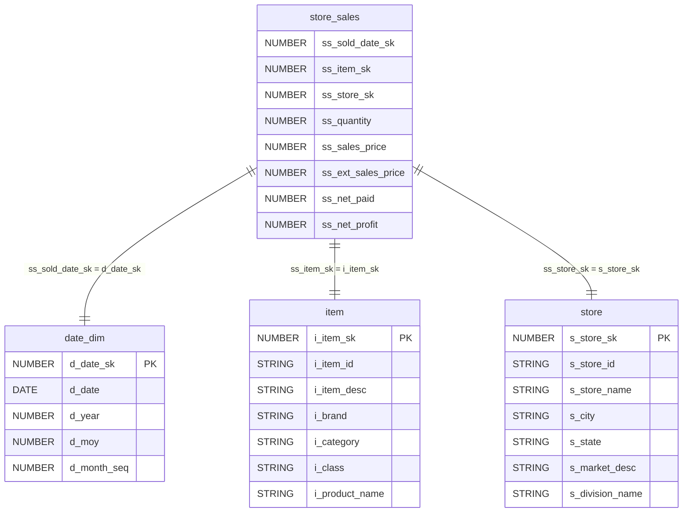
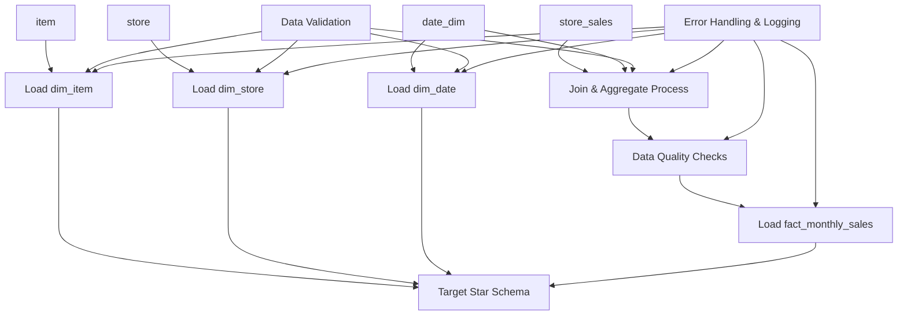
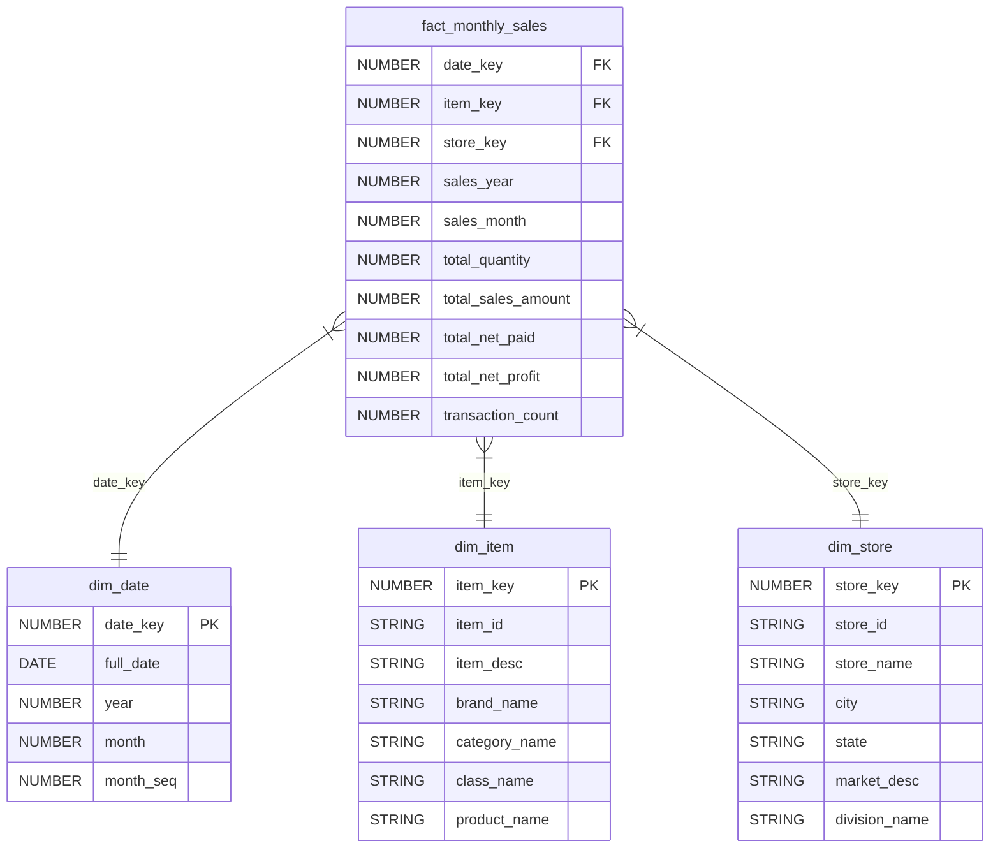

# Monthly Sales Star Schema ETL Design Document

## Overview

### Objective
Design and implement an ETL process to create a star schema data warehouse for monthly sales performance analysis. The solution will aggregate daily sales transactions into monthly summaries and provide dimensional context for business analysts to track sales performance by item and store over time.

### Scope
- Extract data from four source tables: store_sales, date_dim, item, and store
- Transform daily sales transactions into monthly aggregated facts
- Create dimensional tables for items, stores, and dates
- Load data into a star schema optimized for monthly sales analysis
- Implement data quality checks and error handling

### Out of Scope
- Real-time data processing
- Daily or weekly sales aggregations
- Customer dimension analysis
- Historical data migration beyond current source system
- Performance tuning for OLTP workloads

### Assumptions
- Source tables are available in a relational database
- Data arrives on a daily basis with complete transactions
- Business rules for aggregation remain consistent
- Target system supports star schema design patterns
- Surrogate keys in source system are stable and unique

## Source to Target Mapping

### Fact Table: fact_monthly_sales
| Source | Target Column | Transformation Logic |
|--------|---------------|---------------------|
| d_date_sk | date_key | Direct mapping from date dimension |
| ss_item_sk | item_key | Direct mapping from sales fact |
| ss_store_sk | store_key | Direct mapping from sales fact |
| d_year | sales_year | Direct mapping from date dimension |
| d_moy | sales_month | Direct mapping from date dimension |
| ss_quantity | total_quantity | SUM aggregation grouped by year, month, item, store |
| ss_ext_sales_price | total_sales_amount | SUM aggregation grouped by year, month, item, store |
| ss_net_paid | total_net_paid | SUM aggregation grouped by year, month, item, store |
| ss_net_profit | total_net_profit | SUM aggregation grouped by year, month, item, store |
| ss_ticket_number | transaction_count | COUNT DISTINCT aggregation grouped by year, month, item, store |

### Dimension Table: dim_item
| Source Column | Target Column | Transformation Logic |
|---------------|---------------|---------------------|
| i_item_sk | item_key | Direct mapping |
| i_item_id | item_id | Direct mapping |
| i_item_desc | item_desc | Direct mapping |
| i_brand | brand_name | Direct mapping |
| i_category | category_name | Direct mapping |
| i_class | class_name | Direct mapping |
| i_product_name | product_name | Direct mapping |

### Dimension Table: dim_store
| Source Column | Target Column | Transformation Logic |
|---------------|---------------|---------------------|
| s_store_sk | store_key | Direct mapping |
| s_store_id | store_id | Direct mapping |
| s_store_name | store_name | Direct mapping |
| s_city | city | Direct mapping |
| s_state | state | Direct mapping |
| s_market_desc | market_desc | Direct mapping |
| s_division_name | division_name | Direct mapping |

### Dimension Table: dim_date
| Source Column | Target Column | Transformation Logic |
|---------------|---------------|---------------------|
| d_date_sk | date_key | Direct mapping |
| d_date | full_date | Direct mapping |
| d_year | year | Direct mapping |
| d_moy | month | Direct mapping |
| d_month_seq | month_seq | Direct mapping |

## Data Model Diagram

### Source Data Model


## Data Flow Diagram



## Target Data Model

### DDL Statements

```sql
-- Dimension Tables
CREATE TABLE dim_date (
    date_key NUMBER PRIMARY KEY,
    full_date DATE NOT NULL,
    year NUMBER NOT NULL,
    month NUMBER NOT NULL,
    month_seq NUMBER NOT NULL
);

CREATE TABLE dim_item (
    item_key NUMBER PRIMARY KEY,
    item_id VARCHAR2(50) NOT NULL,
    item_desc VARCHAR2(200),
    brand_name VARCHAR2(100),
    category_name VARCHAR2(100),
    class_name VARCHAR2(100),
    product_name VARCHAR2(200)
);

CREATE TABLE dim_store (
    store_key NUMBER PRIMARY KEY,
    store_id VARCHAR2(50) NOT NULL,
    store_name VARCHAR2(100),
    city VARCHAR2(100),
    state VARCHAR2(50),
    market_desc VARCHAR2(200),
    division_name VARCHAR2(100)
);

-- Fact Table
CREATE TABLE fact_monthly_sales (
    date_key NUMBER NOT NULL,
    item_key NUMBER NOT NULL,
    store_key NUMBER NOT NULL,
    sales_year NUMBER NOT NULL,
    sales_month NUMBER NOT NULL,
    total_quantity NUMBER,
    total_sales_amount NUMBER(15,2),
    total_net_paid NUMBER(15,2),
    total_net_profit NUMBER(15,2),
    transaction_count NUMBER,
    PRIMARY KEY (date_key, item_key, store_key),
    FOREIGN KEY (date_key) REFERENCES dim_date(date_key),
    FOREIGN KEY (item_key) REFERENCES dim_item(item_key),
    FOREIGN KEY (store_key) REFERENCES dim_store(store_key)
);
```

### Target Star Schema Diagram



## Dependencies

### ETL Dependencies
- **Upstream Systems**: Source OLTP database containing store_sales, date_dim, item, and store tables
- **Data Availability**: Daily sales transactions must be loaded before monthly aggregation
- **Dimension Loading**: All dimension tables must be loaded before fact table processing
- **Processing Order**: 
  1. Load dim_date, dim_item, dim_store
  2. Validate dimension data completeness
  3. Process and load fact_monthly_sales

### Python Library Dependencies
```python
# Core ETL Libraries
pandas>=1.5.0          # Data manipulation and analysis
sqlalchemy>=1.4.0      # Database connectivity and ORM
pyodbc>=4.0.0          # ODBC database driver
cx_Oracle>=8.0.0       # Oracle database connectivity

# Data Quality Libraries
great_expectations>=0.15.0  # Data validation and quality checks
pandera>=0.13.0             # Data validation for pandas

# Logging and Monitoring
loguru>=0.6.0          # Enhanced logging capabilities
prometheus_client>=0.15.0   # Metrics collection

# Configuration Management
pyyaml>=6.0            # YAML configuration file parsing
python-dotenv>=0.19.0  # Environment variable management

# Utility Libraries
dateutil>=2.8.0        # Date parsing and manipulation
numpy>=1.21.0          # Numerical operations
```

## Data Quality

### Data Quality Checks

#### Source Data Validation
- **Completeness**: Verify no null values in primary/foreign key columns
- **Referential Integrity**: Validate all foreign key relationships exist
- **Data Type Validation**: Ensure numeric columns contain valid numbers
- **Date Validation**: Verify date columns contain valid date formats
- **Business Rule Validation**: 
  - Sales amounts should be non-negative
  - Quantities should be positive integers
  - Dates should be within expected business ranges

#### Target Data Validation
- **Aggregation Accuracy**: Validate sum totals match source data
- **Uniqueness**: Ensure primary key constraints are maintained
- **Consistency**: Verify dimensional attributes remain consistent
- **Completeness**: Check for missing monthly aggregations

### Data Quality Metrics
```python
# Key Quality Metrics to Monitor
- Row count variance: ±5% tolerance
- Null value percentage: <1% for critical fields
- Referential integrity: 100% compliance
- Aggregation accuracy: 99.9% match with source
- Processing time: <2 hours for monthly batch
```

### Data Quality Framework
- **Pre-processing Checks**: Source data validation before transformation
- **In-process Monitoring**: Real-time validation during ETL execution
- **Post-processing Verification**: Target data quality assessment
- **Exception Handling**: Automated alerting for quality threshold breaches

## Recovery

### Recovery Strategy

#### Backup and Restore Procedures
- **Source Data Backup**: Daily incremental backups of source tables
- **Target Data Backup**: Full backup after each successful ETL run
- **Configuration Backup**: Version-controlled ETL scripts and configurations
- **Recovery Point Objective (RPO)**: 24 hours maximum data loss
- **Recovery Time Objective (RTO)**: 4 hours maximum downtime

#### Failure Scenarios and Recovery Actions

**Scenario 1: Source Data Unavailability**
- Detection: Automated connection testing and row count validation
- Response: Alert operations team, retry with exponential backoff
- Recovery: Resume processing once source system is available
- Rollback: Not applicable - wait for source restoration

**Scenario 2: Transformation Process Failure**
- Detection: Exception handling in ETL pipeline
- Response: Log error details, preserve source data state
- Recovery: Fix transformation logic, restart from last checkpoint
- Rollback: Restore target tables from last successful backup

**Scenario 3: Target Database Failure**
- Detection: Database connection monitoring
- Response: Switch to backup database instance if available
- Recovery: Restore target database, replay missed transactions
- Rollback: Restore from last known good backup

**Scenario 4: Data Quality Failure**
- Detection: Automated data quality check failures
- Response: Halt processing, quarantine bad data
- Recovery: Investigate and fix data issues, reprocess clean data
- Rollback: Remove corrupted data, restore previous valid state

#### Recovery Procedures
1. **Immediate Response**: Automated alerting and process suspension
2. **Impact Assessment**: Determine scope and severity of failure
3. **Recovery Execution**: Implement appropriate recovery strategy
4. **Validation**: Verify data integrity post-recovery
5. **Documentation**: Log incident details and lessons learned

#### Monitoring and Alerting
- **Process Monitoring**: Real-time ETL job status tracking
- **Data Monitoring**: Continuous data quality metric evaluation
- **Performance Monitoring**: Processing time and resource utilization
- **Alert Escalation**: Tiered alerting based on severity and duration