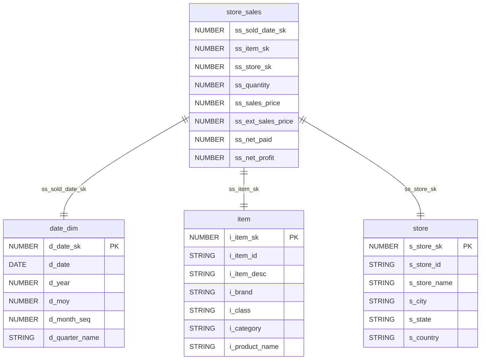
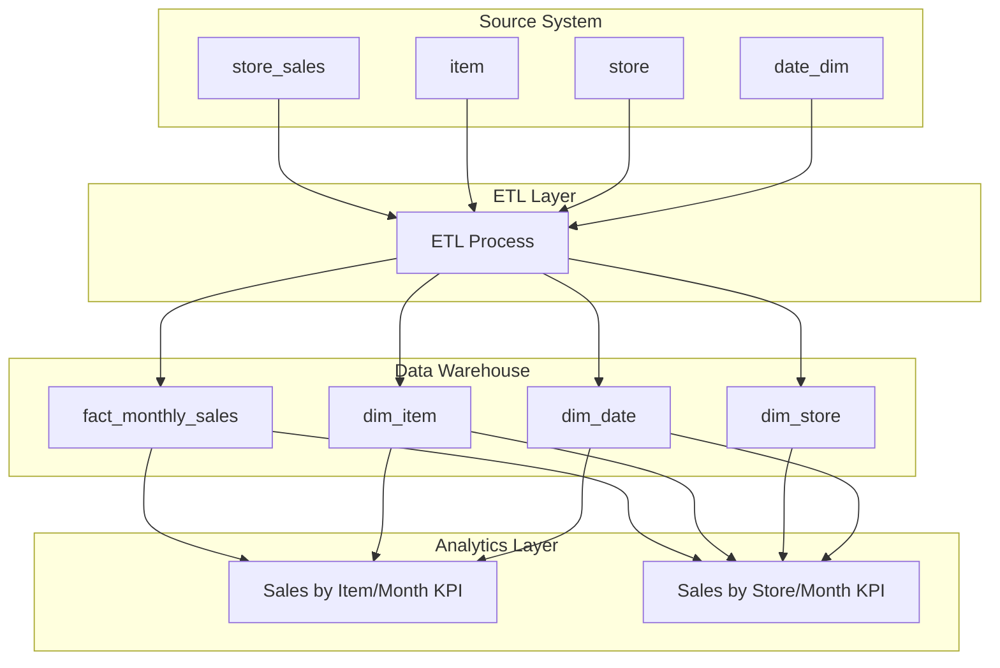

# ETL Design Document: Monthly Sales Star Schema

## Overview

### Objective
Create a dimensional data warehouse following star schema design to support monthly sales analytics. The ETL process will transform transactional sales data into a structure optimized for analyzing sales KPIs by item/month and store/month dimensions.

### Scope
- Extract data from source tables: store_sales, item, store, and date_dim
- Transform data to create fact and dimension tables for star schema
- Load data into target dimensional model tables:
  - fact_monthly_sales (fact table)
  - dim_item (item dimension)
  - dim_store (store dimension) 
  - dim_date (date dimension)
- Enable KPI analysis for sales by item/month and sales by store/month

### Out of Scope
- Real-time data processing
- Historical data versioning (SCD implementation)
- Data lineage tracking
- Cross-selling or market basket analysis
- Customer dimension creation

### Assumptions
- Source data quality is acceptable with minimal cleansing required
- Monthly aggregation granularity is sufficient for business requirements
- All source tables are available and accessible
- Target database supports NUMBER, STRING, and DATE data types
- Business keys (item_id, store_id) are unique within their respective dimensions

## Source to Target Mapping

### Fact Table: fact_monthly_sales

| Target Column | Source Column(s) | Transformation Logic |
|---------------|------------------|---------------------|
| date_key | store_sales.ss_sold_date_sk | Direct mapping from joined date dimension |
| item_key | store_sales.ss_item_sk | Direct mapping |
| store_key | store_sales.ss_store_sk | Direct mapping |
| year_month | date_dim.d_year, date_dim.d_moy | CONCAT(d_year, '-', LPAD(d_moy, 2, '0')) |
| total_quantity | store_sales.ss_quantity | SUM(ss_quantity) GROUP BY date_key, item_key, store_key |
| total_sales_amount | store_sales.ss_ext_sales_price | SUM(ss_ext_sales_price) GROUP BY date_key, item_key, store_key |
| total_net_paid | store_sales.ss_net_paid | SUM(ss_net_paid) GROUP BY date_key, item_key, store_key |
| total_net_profit | store_sales.ss_net_profit | SUM(ss_net_profit) GROUP BY date_key, item_key, store_key |

### Dimension Table: dim_item

| Target Column | Source Column | Transformation Logic |
|---------------|---------------|---------------------|
| item_key | item.i_item_sk | Direct mapping |
| item_id | item.i_item_id | Direct mapping |
| item_name | item.i_product_name | Direct mapping |
| item_description | item.i_item_desc | Direct mapping |
| brand | item.i_brand | Direct mapping |
| category | item.i_category | Direct mapping |
| class | item.i_class | Direct mapping |

### Dimension Table: dim_store

| Target Column | Source Column | Transformation Logic |
|---------------|---------------|---------------------|
| store_key | store.s_store_sk | Direct mapping |
| store_id | store.s_store_id | Direct mapping |
| store_name | store.s_store_name | Direct mapping |
| city | store.s_city | Direct mapping |
| state | store.s_state | Direct mapping |
| country | store.s_country | Direct mapping |

### Dimension Table: dim_date

| Target Column | Source Column | Transformation Logic |
|---------------|---------------|---------------------|
| date_key | date_dim.d_date_sk | Direct mapping |
| date_value | date_dim.d_date | Direct mapping |
| year | date_dim.d_year | Direct mapping |
| month | date_dim.d_moy | Direct mapping |
| year_month | date_dim.d_year, date_dim.d_moy | CONCAT(d_year, '-', LPAD(d_moy, 2, '0')) |
| quarter_name | date_dim.d_quarter_name | Direct mapping |

## Data Model Diagram



## Data Flow Diagram



## Target Data Model

### Fact Table DDL

```sql
CREATE TABLE fact_monthly_sales (
    date_key NUMBER NOT NULL,
    item_key NUMBER NOT NULL,
    store_key NUMBER NOT NULL,
    year_month STRING NOT NULL,
    total_quantity NUMBER,
    total_sales_amount NUMBER,
    total_net_paid NUMBER,
    total_net_profit NUMBER,
    PRIMARY KEY (date_key, item_key, store_key),
    FOREIGN KEY (date_key) REFERENCES dim_date(date_key),
    FOREIGN KEY (item_key) REFERENCES dim_item(item_key),
    FOREIGN KEY (store_key) REFERENCES dim_store(store_key)
);
```

### Dimension Tables DDL

```sql
CREATE TABLE dim_item (
    item_key NUMBER PRIMARY KEY,
    item_id STRING NOT NULL,
    item_name STRING,
    item_description STRING,
    brand STRING,
    category STRING,
    class STRING
);

CREATE TABLE dim_store (
    store_key NUMBER PRIMARY KEY,
    store_id STRING NOT NULL,
    store_name STRING,
    city STRING,
    state STRING,
    country STRING
);

CREATE TABLE dim_date (
    date_key NUMBER PRIMARY KEY,
    date_value DATE NOT NULL,
    year NUMBER,
    month NUMBER,
    year_month STRING,
    quarter_name STRING
);
```

## Dependencies

### ETL Dependencies
- **Upstream Dependencies**: Source tables must be available and populated
  - store_sales (transaction data)
  - item (product master data)
  - store (location master data)
  - date_dim (calendar dimension)

- **Processing Order**:
  1. Load dimension tables first (dim_item, dim_store, dim_date)
  2. Load fact table (fact_monthly_sales) after dimensions are complete

### Python Library Dependencies
```python
# requirements.txt
pandas>=1.5.0
sqlalchemy>=1.4.0
psycopg2-binary>=2.9.0  # for PostgreSQL
pymysql>=1.0.0          # for MySQL
cx-Oracle>=8.3.0        # for Oracle
pyodbc>=4.0.0           # for SQL Server
pydantic>=1.10.0        # for data validation
logging>=0.4.9.6        # for ETL logging
configparser>=5.3.0     # for configuration management
```

## Data Quality

### Data Quality Rules

| Table | Column | Rule | Action on Violation |
|-------|--------|------|-------------------|
| fact_monthly_sales | date_key | NOT NULL, EXISTS in dim_date | Skip record, log error |
| fact_monthly_sales | item_key | NOT NULL, EXISTS in dim_item | Skip record, log error |
| fact_monthly_sales | store_key | NOT NULL, EXISTS in dim_store | Skip record, log error |
| fact_monthly_sales | total_quantity | >= 0 | Skip record, log warning |
| fact_monthly_sales | total_sales_amount | >= 0 | Skip record, log warning |
| dim_item | item_key | NOT NULL, UNIQUE | Fail load |
| dim_store | store_key | NOT NULL, UNIQUE | Fail load |
| dim_date | date_key | NOT NULL, UNIQUE | Fail load |

### Data Quality Checks
- **Referential Integrity**: Verify all foreign keys exist in respective dimension tables
- **Completeness**: Check for NULL values in mandatory fields
- **Consistency**: Validate year_month format (YYYY-MM)
- **Business Rules**: Ensure positive values for quantities and amounts
- **Duplicate Detection**: Identify duplicate records in fact table based on grain

### Quality Metrics
- Record count reconciliation between source and target
- Data completeness percentage by table
- Foreign key violation count
- Business rule violation count

## Recovery

### Backup Strategy
- **Full Backup**: Daily backup of all dimensional tables
- **Incremental Backup**: Hourly backup of fact table during ETL processing
- **Transaction Logs**: Maintain transaction logs for point-in-time recovery

### Recovery Scenarios

#### Scenario 1: ETL Process Failure
- **Detection**: Monitor ETL job status and data quality metrics
- **Recovery Steps**:
  1. Identify point of failure in ETL pipeline
  2. Rollback incomplete transactions
  3. Fix data issues or ETL logic
  4. Restart ETL from last successful checkpoint
  5. Validate data quality post-recovery

#### Scenario 2: Data Corruption
- **Detection**: Data quality validation failure
- **Recovery Steps**:
  1. Stop current ETL processes
  2. Restore from last known good backup
  3. Identify and fix source of corruption
  4. Re-run ETL from backup point
  5. Implement additional data quality checks

#### Scenario 3: Dimension Table Issues
- **Detection**: Foreign key constraint violations
- **Recovery Steps**:
  1. Reload affected dimension tables from source
  2. Validate dimension data completeness
  3. Re-process fact table loads
  4. Verify referential integrity

### Monitoring and Alerting
- **ETL Job Status**: Success/failure notifications
- **Data Quality Alerts**: Threshold-based alerts for quality metrics
- **Performance Monitoring**: ETL execution time tracking
- **Data Volume Alerts**: Unexpected changes in record counts

### Recovery Time Objectives
- **RTO**: Maximum 4 hours for complete system recovery
- **RPO**: Maximum 1 hour of data loss acceptable
- **Dimension Recovery**: 30 minutes
- **Fact Table Recovery**: 2 hours