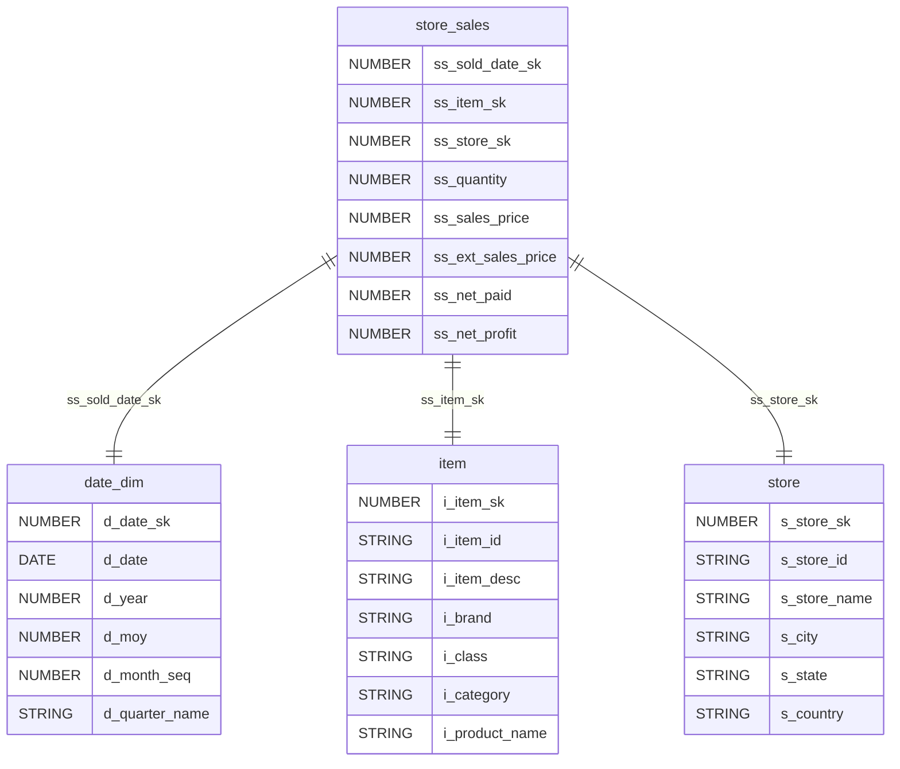
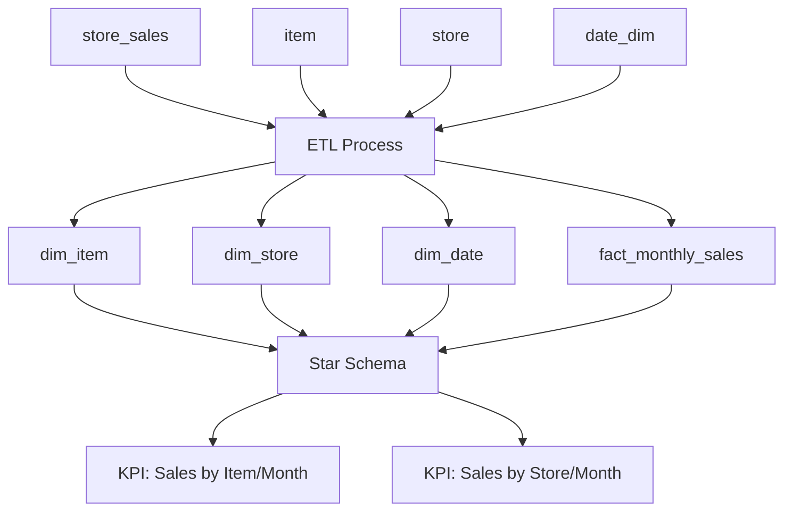
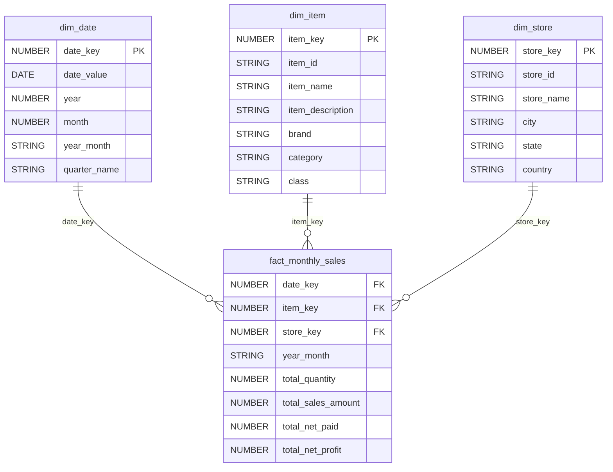

# ETL Design Document: Monthly Sales Star Schema

## Overview

### Objective
Create a star schema data model for analyzing monthly sales performance with KPIs focused on sales by item/month and sales by store/month. This ETL process will transform normalized transactional data into a dimensional model optimized for analytical queries.

### Scope
- Extract data from four source tables: store_sales (fact), item, store, and date_dim
- Transform data into a star schema with one fact table and three dimension tables
- Aggregate sales data at monthly level
- Support KPI analysis for sales performance by item and store dimensions

### Out of Scope
- Daily or weekly level granularity
- Customer dimension analysis
- Real-time data processing
- Historical data versioning (SCD implementation)

### Assumptions
- Source data quality is acceptable with minimal cleansing required
- Monthly aggregation is sufficient for business requirements
- All required foreign key relationships exist in source data
- Date dimension contains complete date range for sales transactions

## Source to Target Mapping

### Fact Table: fact_monthly_sales
| Target Column | Source Column(s) | Transformation Logic |
|---------------|------------------|---------------------|
| date_key | store_sales.ss_sold_date_sk | Direct mapping from sales transaction |
| item_key | store_sales.ss_item_sk | Direct mapping from sales transaction |
| store_key | store_sales.ss_store_sk | Direct mapping from sales transaction |
| year_month | date_dim.d_year + date_dim.d_moy | CONCAT(d_year, '-', LPAD(d_moy, 2, '0')) |
| total_quantity | store_sales.ss_quantity | SUM(ss_quantity) GROUP BY date_key, item_key, store_key |
| total_sales_amount | store_sales.ss_ext_sales_price | SUM(ss_ext_sales_price) GROUP BY date_key, item_key, store_key |
| total_net_paid | store_sales.ss_net_paid | SUM(ss_net_paid) GROUP BY date_key, item_key, store_key |
| total_net_profit | store_sales.ss_net_profit | SUM(ss_net_profit) GROUP BY date_key, item_key, store_key |

### Dimension Tables

#### dim_item
| Target Column | Source Column | Transformation Logic |
|---------------|---------------|---------------------|
| item_key | item.i_item_sk | Direct mapping |
| item_id | item.i_item_id | Direct mapping |
| item_name | item.i_product_name | Direct mapping |
| item_description | item.i_item_desc | Direct mapping |
| brand | item.i_brand | Direct mapping |
| category | item.i_category | Direct mapping |
| class | item.i_class | Direct mapping |

#### dim_store
| Target Column | Source Column | Transformation Logic |
|---------------|---------------|---------------------|
| store_key | store.s_store_sk | Direct mapping |
| store_id | store.s_store_id | Direct mapping |
| store_name | store.s_store_name | Direct mapping |
| city | store.s_city | Direct mapping |
| state | store.s_state | Direct mapping |
| country | store.s_country | Direct mapping |

#### dim_date
| Target Column | Source Column | Transformation Logic |
|---------------|---------------|---------------------|
| date_key | date_dim.d_date_sk | Direct mapping |
| date_value | date_dim.d_date | Direct mapping |
| year | date_dim.d_year | Direct mapping |
| month | date_dim.d_moy | Direct mapping |
| year_month | date_dim.d_year + date_dim.d_moy | CONCAT(d_year, '-', LPAD(d_moy, 2, '0')) |
| quarter_name | date_dim.d_quarter_name | Direct mapping |

## Data Model Diagram

### Source Data Model


## Data Flow Diagram



## Target Data Model

### DDL Statements

```sql
-- Dimension Tables
CREATE TABLE dim_item (
    item_key NUMBER PRIMARY KEY,
    item_id STRING NOT NULL,
    item_name STRING,
    item_description STRING,
    brand STRING,
    category STRING,
    class STRING
);

CREATE TABLE dim_store (
    store_key NUMBER PRIMARY KEY,
    store_id STRING NOT NULL,
    store_name STRING,
    city STRING,
    state STRING,
    country STRING
);

CREATE TABLE dim_date (
    date_key NUMBER PRIMARY KEY,
    date_value DATE NOT NULL,
    year NUMBER,
    month NUMBER,
    year_month STRING,
    quarter_name STRING
);

-- Fact Table
CREATE TABLE fact_monthly_sales (
    date_key NUMBER NOT NULL,
    item_key NUMBER NOT NULL,
    store_key NUMBER NOT NULL,
    year_month STRING NOT NULL,
    total_quantity NUMBER,
    total_sales_amount NUMBER,
    total_net_paid NUMBER,
    total_net_profit NUMBER,
    PRIMARY KEY (date_key, item_key, store_key),
    FOREIGN KEY (date_key) REFERENCES dim_date(date_key),
    FOREIGN KEY (item_key) REFERENCES dim_item(item_key),
    FOREIGN KEY (store_key) REFERENCES dim_store(store_key)
);
```

### Target Star Schema Diagram


## Dependencies

### ETL Dependencies
1. **Execution Order:**
   - Load dimension tables first: dim_date, dim_item, dim_store
   - Load fact table last: fact_monthly_sales
2. **Data Dependencies:**
   - All source tables must be available and populated
   - Date dimension must cover the complete range of sales dates
   - Referential integrity between sales and dimension keys

### Python Library Dependencies
```python
# Core ETL Libraries
pandas==1.5.0
numpy==1.24.0
sqlalchemy==1.4.0

# Database Connectors
psycopg2-binary==2.9.0  # PostgreSQL
pymysql==1.0.2         # MySQL
cx-Oracle==8.3.0       # Oracle

# Data Quality & Testing
great-expectations==0.15.0
pytest==7.2.0

# Logging & Monitoring
loguru==0.6.0
```

## Data Quality

### Data Quality Checks

#### Source Data Validation
1. **Completeness Checks:**
   - Verify no NULL values in primary keys (ss_sold_date_sk, ss_item_sk, ss_store_sk)
   - Validate foreign key relationships exist
   - Check for missing dimension records

2. **Accuracy Checks:**
   - Validate numeric columns are positive (quantities, amounts)
   - Ensure date ranges are reasonable
   - Verify sales amounts match calculated values

3. **Consistency Checks:**
   - Cross-reference item keys across tables
   - Validate store keys consistency
   - Check date dimension completeness

#### Target Data Validation
1. **Aggregation Validation:**
   - Compare source totals with fact table aggregates
   - Validate monthly grouping accuracy
   - Ensure no data loss during transformation

2. **Referential Integrity:**
   - Verify all foreign keys exist in dimension tables
   - Check for orphaned records

### Data Quality Metrics
- **Completeness:** 100% of records must have valid keys
- **Accuracy:** Sales amounts variance < 0.01%
- **Timeliness:** ETL completion within 2-hour SLA
- **Consistency:** Zero referential integrity violations

## Recovery

### Recovery Strategy

#### Backup Strategy
1. **Source Data Backup:**
   - Daily incremental backups of source tables
   - Weekly full backups retained for 12 weeks
   - Point-in-time recovery capability

2. **Target Data Backup:**
   - Pre-ETL snapshot of target tables
   - Post-ETL validation checkpoint
   - Monthly archived copies for historical analysis

#### Recovery Procedures

##### ETL Failure Recovery
1. **Detection:**
   - Automated monitoring alerts on ETL failure
   - Data quality threshold violations trigger alerts
   - Missing data detection through row count validation

2. **Recovery Steps:**
   ```bash
   # Step 1: Identify failure point
   python etl_monitor.py --check-last-run
   
   # Step 2: Restore to last known good state
   python restore_checkpoint.py --date=YYYY-MM-DD
   
   # Step 3: Re-run ETL from failure point
   python monthly_sales_etl.py --restart-from=<step>
   
   # Step 4: Validate data integrity
   python data_quality_check.py --full-validation
   ```

##### Data Corruption Recovery
1. **Immediate Response:**
   - Stop all ETL processes
   - Isolate affected tables
   - Notify stakeholders

2. **Recovery Actions:**
   - Restore from last known good backup
   - Re-run ETL with enhanced validation
   - Perform comprehensive data quality assessment
   - Update recovery procedures based on lessons learned

#### Recovery Testing
- Monthly disaster recovery drills
- Quarterly end-to-end recovery validation
- Annual recovery procedure review and update