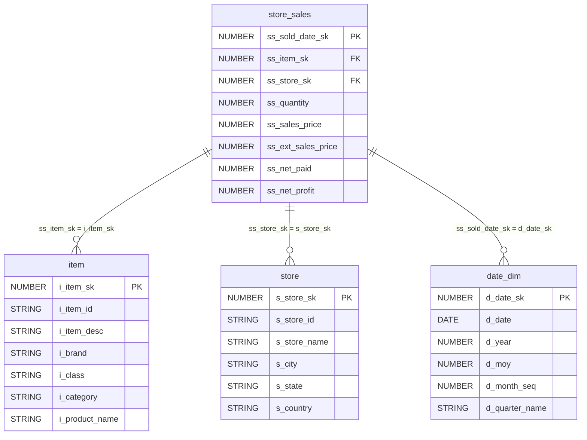
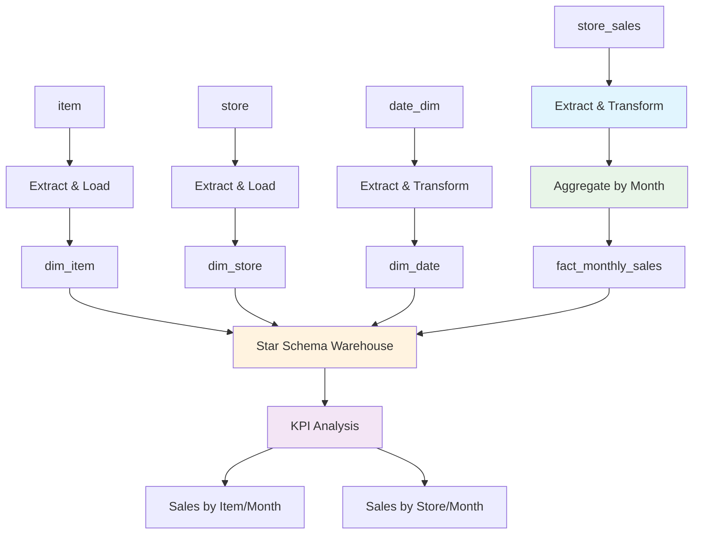
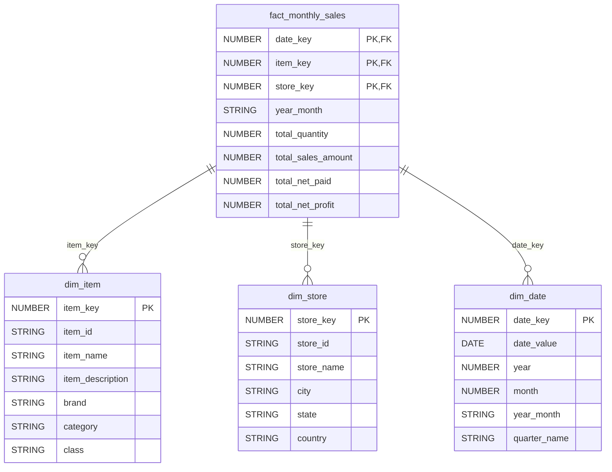

# ETL Design Document: Monthly Sales Star Schema

## 1. Overview

### Objective
Design and implement an ETL process to create a monthly sales star schema data warehouse that enables analysis of sales performance with key performance indicators (KPIs) for sales by item/month and sales by store/month.

### Scope
- Transform normalized source tables (store_sales, item, store, date_dim) into a dimensional star schema
- Create fact table for monthly aggregated sales data
- Create dimension tables for item, store, and date
- Establish proper relationships between fact and dimension tables
- Enable KPI analysis for monthly sales reporting

### Out of Scope
- Real-time data processing
- Historical data versioning (SCD implementation)
- Data lineage tracking beyond basic documentation
- Performance optimization beyond basic indexing

### Assumptions
- Source data is available in a relational database
- Data quality issues in source systems are minimal
- Monthly aggregation is sufficient for business requirements
- All source tables have consistent data types and relationships
- Target system supports SQL-based transformations

## 2. Source to Target Mapping

### Fact Table: fact_monthly_sales

| Target Column | Source Table | Source Column(s) | Transformation Logic |
|---------------|--------------|------------------|----------------------|
| date_key | date_dim | d_date_sk | Direct mapping |
| item_key | store_sales | ss_item_sk | Direct mapping |
| store_key | store_sales | ss_store_sk | Direct mapping |
| year_month | date_dim | d_year, d_moy | CONCAT(d_year, '-', LPAD(d_moy, 2, '0')) |
| total_quantity | store_sales | ss_quantity | SUM(ss_quantity) GROUP BY keys |
| total_sales_amount | store_sales | ss_ext_sales_price | SUM(ss_ext_sales_price) GROUP BY keys |
| total_net_paid | store_sales | ss_net_paid | SUM(ss_net_paid) GROUP BY keys |
| total_net_profit | store_sales | ss_net_profit | SUM(ss_net_profit) GROUP BY keys |

### Dimension Tables

#### dim_item
| Target Column | Source Table | Source Column | Transformation Logic |
|---------------|--------------|---------------|----------------------|
| item_key | item | i_item_sk | Direct mapping |
| item_id | item | i_item_id | Direct mapping |
| item_name | item | i_product_name | Direct mapping |
| item_description | item | i_item_desc | Direct mapping |
| brand | item | i_brand | Direct mapping |
| category | item | i_category | Direct mapping |
| class | item | i_class | Direct mapping |

#### dim_store
| Target Column | Source Table | Source Column | Transformation Logic |
|---------------|--------------|---------------|----------------------|
| store_key | store | s_store_sk | Direct mapping |
| store_id | store | s_store_id | Direct mapping |
| store_name | store | s_store_name | Direct mapping |
| city | store | s_city | Direct mapping |
| state | store | s_state | Direct mapping |
| country | store | s_country | Direct mapping |

#### dim_date
| Target Column | Source Table | Source Column | Transformation Logic |
|---------------|--------------|---------------|----------------------|
| date_key | date_dim | d_date_sk | Direct mapping |
| date_value | date_dim | d_date | Direct mapping |
| year | date_dim | d_year | Direct mapping |
| month | date_dim | d_moy | Direct mapping |
| year_month | date_dim | d_year, d_moy | CONCAT(d_year, '-', LPAD(d_moy, 2, '0')) |
| quarter_name | date_dim | d_quarter_name | Direct mapping |

## 3. Source Data Model Diagram



## 4. Data Flow Diagram



## 5. Target Data Model

### DDL Statements

```sql
-- Dimension Tables
CREATE TABLE dim_item (
    item_key NUMBER PRIMARY KEY,
    item_id STRING NOT NULL,
    item_name STRING,
    item_description STRING,
    brand STRING,
    category STRING,
    class STRING
);

CREATE TABLE dim_store (
    store_key NUMBER PRIMARY KEY,
    store_id STRING NOT NULL,
    store_name STRING,
    city STRING,
    state STRING,
    country STRING
);

CREATE TABLE dim_date (
    date_key NUMBER PRIMARY KEY,
    date_value DATE NOT NULL,
    year NUMBER,
    month NUMBER,
    year_month STRING,
    quarter_name STRING
);

-- Fact Table
CREATE TABLE fact_monthly_sales (
    date_key NUMBER NOT NULL,
    item_key NUMBER NOT NULL,
    store_key NUMBER NOT NULL,
    year_month STRING NOT NULL,
    total_quantity NUMBER,
    total_sales_amount NUMBER,
    total_net_paid NUMBER,
    total_net_profit NUMBER,
    PRIMARY KEY (date_key, item_key, store_key),
    FOREIGN KEY (date_key) REFERENCES dim_date(date_key),
    FOREIGN KEY (item_key) REFERENCES dim_item(item_key),
    FOREIGN KEY (store_key) REFERENCES dim_store(store_key)
);
```

### Target Data Model Diagram



## 6. Dependencies

### ETL Dependencies
- **Data Availability**: Source tables (store_sales, item, store, date_dim) must be available and populated
- **Execution Order**: 
  1. Load dimension tables first (dim_item, dim_store, dim_date)
  2. Load fact table (fact_monthly_sales) after all dimensions are populated
- **System Dependencies**: Database connection and sufficient storage capacity

### Python Library Dependencies
```python
# requirements.txt
pandas>=1.5.0
sqlalchemy>=1.4.0
psycopg2-binary>=2.9.0  # For PostgreSQL
cx_Oracle>=8.0.0        # For Oracle
pymysql>=1.0.0          # For MySQL
python-dotenv>=0.19.0   # For environment variables
logging>=0.4.9.6        # For logging
pytest>=7.0.0           # For testing
```

## 7. Data Quality

### Data Quality Rules

| Table | Column | Rule Type | Rule Description | Action on Failure |
|-------|--------|-----------|------------------|-------------------|
| fact_monthly_sales | date_key | NOT NULL | Date key must exist | Log error, skip record |
| fact_monthly_sales | item_key | REFERENTIAL | Must exist in dim_item | Log error, skip record |
| fact_monthly_sales | store_key | REFERENTIAL | Must exist in dim_store | Log error, skip record |
| fact_monthly_sales | total_quantity | RANGE | Must be >= 0 | Log warning, set to 0 |
| fact_monthly_sales | total_sales_amount | RANGE | Must be >= 0 | Log warning, set to 0 |
| dim_item | item_key | UNIQUENESS | Primary key uniqueness | Fail load |
| dim_store | store_key | UNIQUENESS | Primary key uniqueness | Fail load |
| dim_date | date_key | UNIQUENESS | Primary key uniqueness | Fail load |

### Data Quality Checks
- **Completeness**: Verify all expected records are loaded
- **Consistency**: Cross-validate totals between source and target
- **Accuracy**: Sample data validation against business rules
- **Timeliness**: Monitor ETL execution time and data freshness

## 8. Recovery

### Backup Strategy
- **Full Backup**: Daily backup of all target tables
- **Incremental Backup**: Transaction log backup every 15 minutes
- **Point-in-time Recovery**: Maintain 30-day recovery window

### Recovery Procedures

#### ETL Failure Recovery
1. **Identify Failure Point**: Check ETL logs for specific error location
2. **Data Validation**: Verify data integrity in successfully loaded tables
3. **Rollback Strategy**: 
   - Truncate partially loaded fact table
   - Restore dimension tables if corrupted
   - Re-run ETL from last successful checkpoint
4. **Restart Process**: Execute ETL with appropriate parameters

#### Data Corruption Recovery
1. **Isolate Affected Tables**: Identify scope of corruption
2. **Restore from Backup**: Use most recent clean backup
3. **Replay Transactions**: Apply incremental changes since backup
4. **Validate Results**: Run data quality checks post-recovery

#### Disaster Recovery
1. **Failover to Secondary Site**: If primary system unavailable
2. **Data Synchronization**: Ensure secondary site has latest data
3. **Business Continuity**: Maintain analytical capabilities during recovery
4. **Failback Procedure**: Systematic return to primary environment

### Monitoring and Alerting
- **ETL Job Monitoring**: Real-time status tracking
- **Data Quality Alerts**: Automated notifications for quality violations
- **Performance Monitoring**: Track execution time and resource usage
- **System Health Checks**: Regular validation of system components