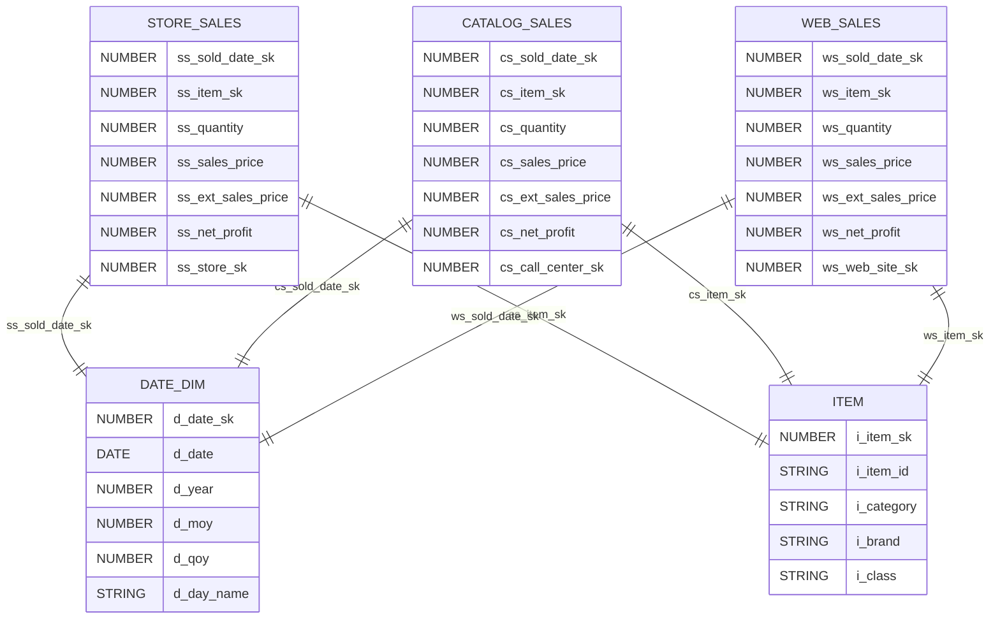
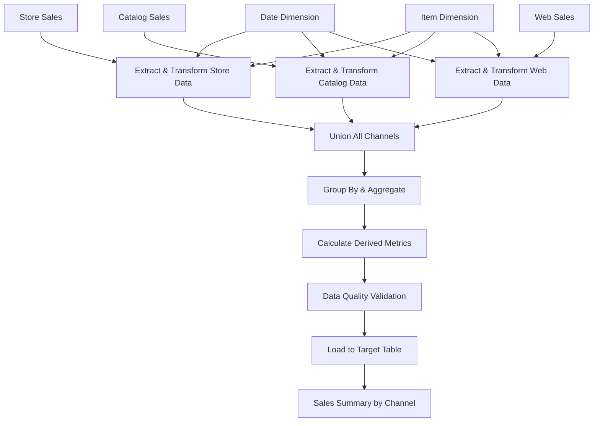

# ETL Design Document: Sales Summary by Channel

## Overview

### Objective
Create a unified sales summary ETL process that aggregates sales data from three different channels (store, catalog, and web) into a single target table for analytical reporting and business intelligence purposes.

### Scope
- Extract sales data from store_sales, catalog_sales, and web_sales tables
- Join with dimension tables (date_dim and item) to enrich the data
- Transform and aggregate sales metrics by channel, date, and item attributes
- Load the aggregated data into the sales_summary_by_channel target table

### Out of Scope
- Real-time data processing
- Historical data backfill beyond current ETL run
- Data archival and retention policies
- Performance optimization for ad-hoc queries

### Assumptions
- Source tables are available and accessible during ETL execution
- Data quality checks are performed upstream
- All foreign key relationships are maintained in source systems
- ETL runs on a scheduled basis (daily/weekly)

## Source to Target Mapping

| Target Column | Source | Transformation Logic |
|---------------|--------|---------------------|
| sale_date | date_dim.d_date | Direct mapping from date dimension |
| year | date_dim.d_year | Direct mapping from date dimension |
| month | date_dim.d_moy | Direct mapping from date dimension |
| quarter | date_dim.d_qoy | Direct mapping from date dimension |
| day_name | date_dim.d_day_name | Direct mapping from date dimension |
| channel | Static values | 'store' for store_sales, 'catalog' for catalog_sales, 'web' for web_sales |
| item_category | item.i_category | Direct mapping from item dimension |
| item_brand | item.i_brand | Direct mapping from item dimension |
| item_class | item.i_class | Direct mapping from item dimension |
| total_quantity | SUM(quantity fields) | SUM(ss_quantity + cs_quantity + ws_quantity) |
| total_sales_amount | SUM(ext_sales_price fields) | SUM(ss_ext_sales_price + cs_ext_sales_price + ws_ext_sales_price) |
| total_net_profit | SUM(net_profit fields) | SUM(ss_net_profit + cs_net_profit + ws_net_profit) |
| avg_unit_price | Calculated | total_sales_amount / total_quantity |
| transaction_count | COUNT(DISTINCT) | COUNT(DISTINCT transaction identifiers) |

## Data Model Diagram



## Data Flow Diagram



## Target Data Model

```sql
CREATE TABLE sales_summary_by_channel (
    sale_date DATE NOT NULL,
    year NUMBER(4) NOT NULL,
    month NUMBER(2) NOT NULL,
    quarter NUMBER(1) NOT NULL,
    day_name STRING(20),
    channel STRING(10) NOT NULL,
    item_category STRING(50),
    item_brand STRING(50),
    item_class STRING(50),
    total_quantity NUMBER(18,2),
    total_sales_amount NUMBER(18,2),
    total_net_profit NUMBER(18,2),
    avg_unit_price NUMBER(18,4),
    transaction_count NUMBER(18,0),
    created_date TIMESTAMP DEFAULT CURRENT_TIMESTAMP,
    updated_date TIMESTAMP DEFAULT CURRENT_TIMESTAMP,
    
    CONSTRAINT pk_sales_summary PRIMARY KEY (sale_date, channel, item_category, item_brand, item_class)
);

CREATE INDEX idx_sales_summary_date ON sales_summary_by_channel(sale_date);
CREATE INDEX idx_sales_summary_channel ON sales_summary_by_channel(channel);
CREATE INDEX idx_sales_summary_category ON sales_summary_by_channel(item_category);
```

## Dependencies

### ETL Dependencies
- **Upstream Tables**: 
  - store_sales (must be loaded before ETL execution)
  - catalog_sales (must be loaded before ETL execution)
  - web_sales (must be loaded before ETL execution)
  - date_dim (must be current and complete)
  - item (must be current and complete)

### Python Library Dependencies
```python
# requirements.txt
pandas>=1.5.0
sqlalchemy>=1.4.0
psycopg2-binary>=2.9.0  # PostgreSQL adapter
cx-Oracle>=8.3.0        # Oracle adapter
pymongo>=4.0.0          # MongoDB adapter (if applicable)
pyspark>=3.3.0          # For big data processing
pytest>=7.0.0           # For unit testing
logging>=0.4.9.6        # For logging
configparser>=5.3.0     # For configuration management
```

## Data Quality

### Data Quality Checks
1. **Referential Integrity**
   - Verify all date_sk values exist in date_dim table
   - Verify all item_sk values exist in item table

2. **Data Completeness**
   - Check for NULL values in critical fields (sale_date, channel, quantities)
   - Validate that all expected channels are present

3. **Data Accuracy**
   - Verify total_quantity > 0 for valid transactions
   - Validate avg_unit_price calculation accuracy
   - Check for negative sales amounts or quantities

4. **Data Consistency**
   - Ensure date ranges are consistent across all channels
   - Validate that aggregated totals match source data sums

### Quality Validation Rules
```python
quality_rules = {
    'total_quantity': 'total_quantity >= 0',
    'total_sales_amount': 'total_sales_amount >= 0',
    'avg_unit_price': 'avg_unit_price > 0 OR total_quantity = 0',
    'transaction_count': 'transaction_count > 0',
    'channel_values': "channel IN ('store', 'catalog', 'web')"
}
```

## Recovery

### Error Handling Strategy
1. **Graceful Degradation**
   - Continue processing other channels if one channel fails
   - Log detailed error messages for troubleshooting

2. **Rollback Mechanism**
   - Implement transaction-based loading to enable rollback on failure
   - Maintain backup of previous successful load

3. **Retry Logic**
   - Implement exponential backoff for transient failures
   - Maximum retry attempts: 3 times with 5-minute intervals

### Recovery Procedures
1. **Data Validation Failure**
   - Stop processing and alert data engineering team
   - Investigate data quality issues at source
   - Rerun ETL after source data correction

2. **System Failure**
   - Restart ETL from last successful checkpoint
   - Verify data integrity before resuming
   - Monitor system resources and performance

3. **Partial Load Failure**
   - Identify failed partitions or channels
   - Reprocess only failed components
   - Validate final aggregated results

### Monitoring and Alerting
- **Success Metrics**: Record count, processing time, data volume
- **Failure Alerts**: Email notifications for ETL failures
- **Performance Monitoring**: Track execution time trends and resource utilization
- **Data Freshness**: Alert if ETL doesn't complete within SLA timeframe